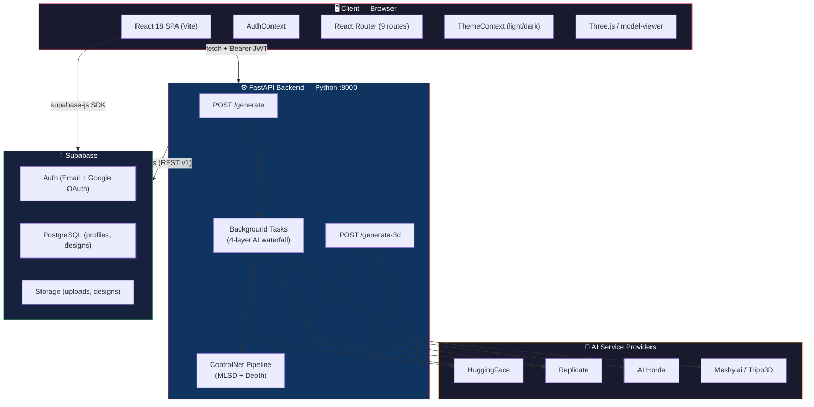
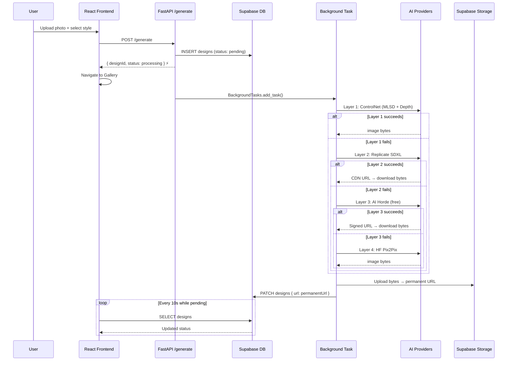
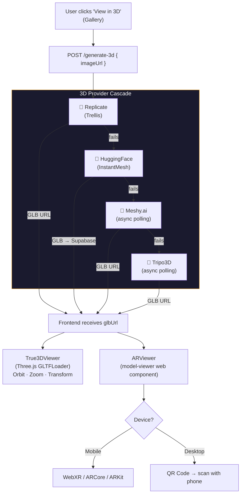

# 🏠 Home Gennie — AI Interior Design Platform

> **Transform any room into an architectural masterpiece using multi-layer AI generation, real-time 3D reconstruction, and cross-platform AR visualization.**

---

## Table of Contents

- [About the Project](#about-the-project)
- [Live Features](#live-features)
- [Tech Stack](#tech-stack)
- [Project Structure](#project-structure)
- [Architecture Overview](#architecture-overview)
- [AI Generation Pipeline](#ai-generation-pipeline)
- [3D & AR Pipeline](#3d--ar-pipeline)
- [Database Schema](#database-schema)
- [Pages & Routes](#pages--routes)
- [Components](#components)
- [Services](#services)
- [Environment Variables](#environment-variables)
- [Getting Started](#getting-started)
- [Development Scripts](#development-scripts)

---

## About the Project

**Home Gennie** is a full-stack AI-powered interior design SaaS platform. Users upload a photo of their existing room and the platform uses a **4-layer AI waterfall** to generate a photorealistic redesign in a chosen style — Modern, Minimalist, Scandinavian, Industrial, Bohemian, or Classic — while **preserving the exact room geometry** (walls, windows, doors, ceiling height, camera angle).

Once a design is generated, it can be **reconstructed into a 3D GLB model** using image-to-3D AI, then viewed interactively in-browser using Three.js or projected into the user's real-world room via **WebXR / ARKit AR**.

The platform was built to be:
- **Zero-cost in operation** — multi-tier AI fallback uses free providers (HuggingFace, AI Horde) before paid (Replicate)
- **Always persistent** — all generated images are downloaded from expiring CDN URLs and permanently stored in Supabase Storage
- **Async-first** — generation runs in background tasks; the UI never blocks on AI response latency
- **Full-stack** — React (Vite) frontend + Python FastAPI backend + Supabase BaaS

---

## Live Features

| Feature | Description |
|---|---|
| 🔐 **Authentication** | Email/password + Google OAuth via Supabase Auth |
| 🖼️ **Room Upload** | Drag-and-drop room photo upload to Supabase `uploads` bucket |
| 🎨 **Style Selection** | 6 design styles × 6 room types with color palette and budget selector |
| ⚡ **Async AI Generation** | 4-layer waterfall (ControlNet → Replicate SDXL → AI Horde → Pix2Pix), runs in background |
| 📸 **Permanent Storage** | All generated images downloaded and re-uploaded to Supabase `designs` bucket |
| 🟡 **Pending States** | Gallery polls every 10 seconds while any design is generating |
| 🗂️ **Design Gallery** | Filterable grid of all user designs with before/after states |
| 📦 **3D Reconstruction** | Convert any generated image to a GLB 3D model via Replicate / HuggingFace / Meshy / Tripo |
| 🌐 **3D Viewer** | Interactive Three.js viewer with orbit, zoom, lighting controls, fullscreen |
| 📱 **AR Visualization** | WebXR (Android ARCore) + AR Quick Look (iOS ARKit) via `<model-viewer>` |
| 📲 **QR Code AR** | Desktop generates a QR code so users can project the 3D model on their phone |
| 👤 **User Profile** | Edit display name, trigger password reset |
| 🌙 **Dark / Light Mode** | System theme toggle persisted in `localStorage` |
| 📊 **Dashboard** | Stats (total designs, this week), quick actions, trending styles |

---

## Tech Stack

### Frontend
| Technology | Version | Purpose |
|---|---|---|
| React | ^18.3.1 | UI component framework |
| Vite | ^5.4.0 | Build tool & dev server |
| React Router DOM | ^7.13.1 | Client-side routing |
| Framer Motion | ^12.38.0 | Declarative animations (Gallery) |
| Three.js | ^0.183.2 | 3D scene rendering (style previewer) |
| Lucide React | ^0.576.0 | Icon library |
| @supabase/supabase-js | ^2.98.0 | Supabase client (auth + DB + storage) |
| QRCode | ^1.5.4 | AR QR code generation on desktop |
| Tailwind CSS | ^4.2.1 | Utility CSS (used selectively) |

### Backend
| Technology | Version | Purpose |
|---|---|---|
| Python | 3.10+ | Runtime |
| FastAPI | ^0.115.0 | Async REST API framework |
| Uvicorn | ^0.34.0 | ASGI server |
| Pydantic | ^2.0.0 | Request/response model validation |
| `replicate` | ^1.0.4 | Replicate API (SDXL, Trellis 3D) |
| `gradio_client` | ^2.3.0 | HuggingFace Space client (ControlNet) |
| `controlnet_aux` | ^0.0.7 | Local MLSD line detector (CPU) |
| `transformers` | ^4.40.0 | HF DPT depth estimator (CPU fallback) |
| Pillow | ^10.0.0 | Image processing |
| `python-dotenv` | ^1.0.0 | `.env` loading |
| `requests` | ^2.31.0 | HTTP calls to Supabase REST + AI APIs |

### Infrastructure & BaaS
| Service | Role |
|---|---|
| **Supabase** | PostgreSQL database, Auth (email + Google OAuth), Storage (two buckets) |
| **Supabase Storage** | `uploads` bucket (raw photos), `designs` bucket (generated images + 3D models) |
| **HuggingFace** | ControlNet inference (GPU Space), Depth API, Pix2Pix model, local model cache |
| **Replicate** | SDXL image generation, Trellis image-to-3D |
| **AI Horde** | Free anonymous fallback for image generation |
| **Google model-viewer** | CDN web component for 3D/AR rendering |

---

## Project Structure

```
ai-interior-design/
│
├── 📁 src/                          # React frontend (Vite)
│   ├── main.jsx                     # App entry point
│   ├── App.jsx                      # Router, ThemeProvider, AuthProvider
│   ├── index.css                    # Global styles, CSS variables, dark mode tokens
│   │
│   ├── 📁 pages/                    # Route-level page components
│   │   ├── Home.jsx                 # Marketing landing page
│   │   ├── Login.jsx                # Email + Google sign in
│   │   ├── Signup.jsx               # New account registration
│   │   ├── Dashboard.jsx            # User hub: stats, quick actions, trending
│   │   ├── Upload.jsx               # 5-step design wizard (upload → generate)
│   │   ├── Gallery.jsx              # Design grid with polling + filter
│   │   ├── Viewer3D.jsx             # 3D viewer + AR launcher page
│   │   ├── Profile.jsx              # Edit display name, password reset
│   │   └── UpdatePassword.jsx       # Password reset form (from email link)
│   │
│   ├── 📁 components/               # Reusable UI components
│   │   ├── Navbar.jsx               # Global top navigation bar
│   │   ├── Footer.jsx               # Global footer
│   │   ├── ProtectedRoute.jsx       # Auth guard wrapper
│   │   ├── PageTransition.jsx       # Framer Motion page wrapper
│   │   ├── ImageUploader.jsx        # Drag-and-drop file input
│   │   ├── ThreeViewer.jsx          # Three.js style preview (no image needed)
│   │   ├── True3DViewer.jsx         # GLB model viewer (after 3D generation)
│   │   ├── ARViewer.jsx             # <model-viewer> AR component + QR code
│   │   ├── DesignCard.jsx           # Gallery card with hover effects
│   │   ├── DesignDetailModal.jsx    # Fullscreen design detail modal
│   │   ├── ComparisonSlider.jsx     # Before/after image comparison slider
│   │   └── ImageRoomViewer.jsx      # Room image viewing with overlay controls
│   │
│   └── 📁 services/                 # Service layer (API abstraction)
│       ├── supabase.js              # Supabase client singleton
│       ├── auth.jsx                 # AuthContext + useAuth hook
│       ├── api.js                   # FastAPI backend calls (generate, 3D)
│       ├── aiService.js             # Frontend AI utility helpers
│       └── mockAI.js                # Mock/demo AI responses for testing
│
├── 📁 backend/                      # Python FastAPI backend
│   ├── main.py                      # API server: /generate, /generate-3d
│   ├── controlnet_pipeline.py       # ControlNet MLSD + Depth pipeline
│   ├── requirements.txt             # Python dependencies
│   ├── .env                         # Backend secrets (NOT committed)
│   └── .env.example                 # Template for secrets
│
├── 📁 public/                       # Static assets served by Vite
├── 📁 scripts/                      # Utility scripts
├── supabase_setup.sql               # Full Supabase schema (tables, RLS, triggers)
├── migrate_buckets.py               # One-time migration script for storage buckets
├── .env.local                       # Frontend secrets (Supabase URL + anon key)
├── .env.example                     # Frontend env template
├── package.json                     # Frontend dependencies + scripts
├── vite.config.js                   # Vite build configuration
├── eslint.config.js                 # ESLint configuration
└── index.html                       # HTML shell (loads model-viewer CDN script)
```

---

## Architecture Overview



> For a deep-dive into every component, see [ARCHITECTURE.md](./ARCHITECTURE.md).

---

## AI Generation Pipeline

### 2D Image Generation (4-Layer Waterfall)

Every generation request spawns a **non-blocking background task** in FastAPI. The frontend gets an immediate `{ designId, status: "processing" }` response and navigates to the Gallery, which polls every 10 seconds.



**Key Design Principles:**
1. **Never save expiring URLs** — all generations download bytes and re-upload to Supabase immediately
2. **Never delete on failure** — user's original photo is always preserved
3. **Geometry preservation** — ControlNet conditions on MLSD (walls/doors/windows) + depth map; the AI cannot change room structure

---

## 3D & AR Pipeline



---

## Database Schema

### `public.profiles`
| Column | Type | Description |
|---|---|---|
| `id` | UUID (FK → auth.users) | Primary key, same as auth user ID |
| `updated_at` | timestamptz | Last profile update |
| `display_name` | text | User's chosen studio name |
| `avatar_url` | text | Optional avatar image URL |

**RLS Policies:** Viewable by all, insert/update by owner only.

**Trigger:** `on_auth_user_created` — auto-creates profile row from `raw_user_meta_data.display_name` on signup.

### `public.designs`
| Column | Type | Description |
|---|---|---|
| `id` | UUID | Primary key (auto-generated) |
| `user_id` | UUID (FK → auth.users) | Owner, used for RLS |
| `created_at` | timestamptz | Record creation time |
| `original_image_url` | text | Permanent Supabase URL of raw upload |
| `generated_image_url` | text | `"pending"` → `"failed"` → permanent URL |
| `style` | text | e.g. `"Modern"`, `"Scandinavian"` |
| `room_type` | text | e.g. `"Living Room"`, `"Kitchen"` |
| `prompt_used` | text | Exact prompt sent to AI |

**RLS Policies:** Full CRUD only by record owner.

### Storage Buckets
| Bucket | Path Pattern | Contents |
|---|---|---|
| `uploads` | `{user_id}/{timestamp}.{ext}` | Raw user room photos |
| `designs` | `{user_id}/{timestamp}_{label}.jpg` | AI-generated images |
| `designs` | `3d_models/{timestamp}_{name}.glb` | Generated 3D models |

---

## Pages & Routes

| Route | Page | Auth Required | Description |
|---|---|---|---|
| `/` | `Home.jsx` | No | Marketing landing page |
| `/login` | `Login.jsx` | No | Email + Google sign in |
| `/signup` | `Signup.jsx` | No | New account creation |
| `/dashboard` | `Dashboard.jsx` | ✅ Yes | User hub with stats and recent designs |
| `/upload` | `Upload.jsx` | ✅ Yes | 5-step design creation wizard |
| `/gallery` | `Gallery.jsx` | ✅ Yes | Filterable design collection with polling |
| `/viewer` | `Viewer3D.jsx` | No (optional) | 3D viewer + AR launcher |
| `/profile` | `Profile.jsx` | ✅ Yes | Edit name, request password reset |
| `/update-password` | `UpdatePassword.jsx` | No | Password reset via email link |

---

## Components

| Component | Description |
|---|---|
| `Navbar.jsx` | Sticky top nav with links, user avatar, dropdown menu |
| `Footer.jsx` | Site footer with links |
| `ProtectedRoute.jsx` | Redirects unauthenticated users to `/login` |
| `PageTransition.jsx` | Framer Motion wrapper for smooth page transitions |
| `ImageUploader.jsx` | Drag-and-drop + click-to-browse file input |
| `ThreeViewer.jsx` | Three.js static 3D room scene (style preview, no image) |
| `True3DViewer.jsx` | Three.js GLB loader for actual AI-generated 3D model |
| `ARViewer.jsx` | `<model-viewer>` wrapper with WebXR + QR code generation |
| `DesignCard.jsx` | Gallery grid card with status badge and hover effects |
| `DesignDetailModal.jsx` | Fullscreen lightbox for a single design |
| `ComparisonSlider.jsx` | Drag slider to compare before/after images |
| `ImageRoomViewer.jsx` | Enhanced room image viewer with overlay controls |

---

## Services

### `src/services/supabase.js`
Singleton Supabase client. Reads `VITE_SUPABASE_URL` and `VITE_SUPABASE_ANON_KEY` from Vite env.

### `src/services/auth.jsx`
React Context providing `{ user, loading, signUp, signIn, signInWithGoogle, signOut }`. Subscribes to `onAuthStateChange` for real-time session sync. Used via `useAuth()` hook throughout the app.

### `src/services/api.js`
All calls to the FastAPI backend go through this module:
- Automatically attaches `Authorization: Bearer <jwt>` from current Supabase session
- `checkHealth()` — ping `/health`
- `generateDesign({ userId, originalImageUrl, style, roomType })` — POST `/generate`
- `generate3DModel(imageUrl)` — POST `/generate-3d`

### `src/services/aiService.js`
Frontend AI utility helpers (prompt building, style mapping).

### `src/services/mockAI.js`
Provides mock/demo AI responses for local development without a running backend.

---

## Environment Variables

### Frontend (`.env.local`)
```env
VITE_SUPABASE_URL=https://your-project.supabase.co
VITE_SUPABASE_ANON_KEY=your-anon-key
VITE_API_URL=http://localhost:8000   # optional, defaults to localhost:8000
```

### Backend (`backend/.env`)
```env
SUPABASE_URL=https://your-project.supabase.co
SUPABASE_KEY=your-service-role-key

HF_TOKEN=hf_...               # HuggingFace token (enables Layer 1 + Layer 4)
REPLICATE_API_TOKEN=r8_...    # Replicate API token (Layer 2 + 3D Provider 1)
MESHY_API_KEY=...             # Meshy.ai key (optional, 3D Provider 3)
TRIPO_API_KEY=...             # Tripo3D key (optional, 3D Provider 4)
USE_FREE_MODE=false           # Set true to skip paid providers
```

> **Note:** The backend uses the **service role key** (not anon key) to write to the database and storage on behalf of users.

---

## Getting Started

### Prerequisites
- Node.js 18+
- Python 3.10+ with pip
- A Supabase project with `uploads` and `designs` storage buckets (public)

### 1. Clone the repository
```bash
git clone https://github.com/Akhassan12/Home-Gennie.git
cd Home-Gennie
```

### 2. Install frontend dependencies
```bash
npm install
```

### 3. Configure frontend environment
```bash
cp .env.example .env.local
# Edit .env.local with your Supabase URL and anon key
```

### 4. Set up the database
Run the SQL in `supabase_setup.sql` in your Supabase SQL editor.

### 5. Install backend dependencies
```bash
cd backend
python -m venv .venv
.venv\Scripts\activate        # Windows
# source .venv/bin/activate   # macOS/Linux

pip install -r requirements.txt

# For Windows CPU PyTorch:
pip install torch torchvision --index-url https://download.pytorch.org/whl/cpu
```

### 6. Configure backend environment
```bash
cp backend/.env.example backend/.env
# Edit backend/.env with your API keys
```

### 7. Run both servers

**Terminal 1 — Frontend:**
```bash
npm run dev
# → http://localhost:5173
```

**Terminal 2 — Backend:**
```bash
npm run start-backend
# → http://localhost:8000
```

---

## Development Scripts

| Script | Command | Description |
|---|---|---|
| `dev` | `npm run dev` | Start Vite frontend dev server |
| `build` | `npm run build` | Build production frontend bundle |
| `preview` | `npm run preview` | Preview production build locally |
| `lint` | `npm run lint` | Run ESLint on all source files |
| `start-backend` | `npm run start-backend` | Start FastAPI with uvicorn hot-reload |

---

## Design System

The app uses a warm, earthy premium design language:

| Token | Value | Usage |
|---|---|---|
| Primary | `#884530` | CTA buttons, active states, brand |
| Secondary | `#6b5c4c` | Supporting text, icons |
| Background | `#fbf9f6` | Page background |
| Surface | `#ffffff` | Cards, nav |
| Container | `#efeeeb` | Section backgrounds |
| Font (Display) | Noto Serif | Headings, titles |
| Font (Body) | Inter | Labels, body text |

---

*Built with the GSD (Get Shit Done) methodology — spec-driven, empirically verified, zero-waste development.*
